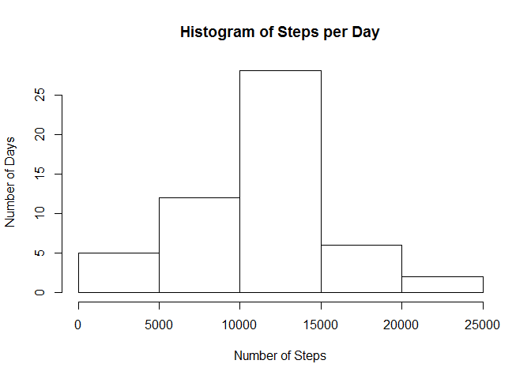
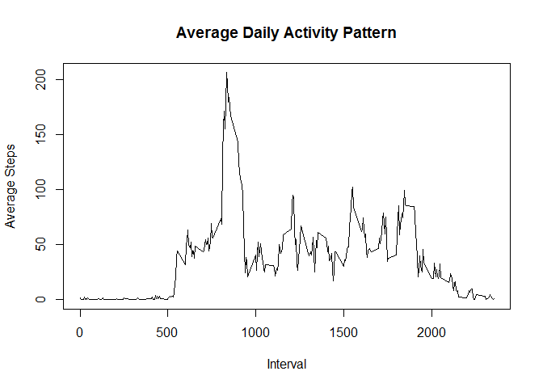
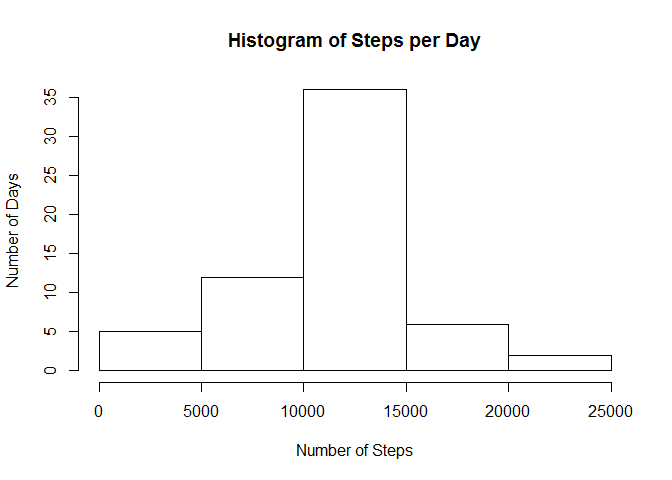

# Reproducible Research: Peer Assessment 1


## Loading and preprocessing the data
Here is where I load the data

```r
data <- read.csv('./activity/activity.csv')
```


## What is mean total number of steps taken per day?
The total amount of steps for each day is as follows:

Here are all the steps for each day!

```r
totalsteps <- aggregate(data$steps, by = list(data$date), FUN=sum)
colnames(totalsteps) <- c("Date", "steps")
##histogram
hist(totalsteps$steps,
      xlab="Number of Steps",
      ylab="Number of Days",
      main="Histogram of Steps per Day")
```

<!-- -->

```r
##mean and median
mean(totalsteps$steps, na.rm = TRUE)
```

```
## [1] 10766.19
```

```r
median(totalsteps$steps, na.rm = TRUE)
```

```
## [1] 10765
```

## What is the average daily activity pattern?
Here is the average daily activity pattern.

```r
ts <- aggregate(data$steps, by = list(data$interval), FUN=mean, na.rm = TRUE)
plot(ts$Group.1, ts$x, type="l", main = "Average Daily Activity Pattern", xlab = "Interval", ylab = "Average Steps")
```

<!-- -->

```r
ts$Group.1[which.max(ts$x)]
```

```
## [1] 835
```
## Imputing missing values
Here are the total number of NAs

```r
sum(is.na(data$steps))
```

```
## [1] 2304
```

```r
imputedData <- transform(data, steps = ifelse(is.na(data$steps), ts$x[match(data$interval, ts$Group.1)], data$steps))

##histogram
imputedtotalsteps <- aggregate(imputedData$steps, by = list(imputedData$date), FUN=sum)
colnames(imputedtotalsteps) <- c("Date", "steps")
hist(imputedtotalsteps$steps,
      xlab="Number of Steps",
      ylab="Number of Days",
      main="Histogram of Steps per Day")
```

<!-- -->

```r
##mean and median
mean(imputedtotalsteps$steps)
```

```
## [1] 10766.19
```

```r
median(imputedtotalsteps$steps)
```

```
## [1] 10766.19
```


## Are there differences in activity patterns between weekdays and weekends?

Here is the graph for Weekend vs. Weekday.

```r
library(lattice)
weekdays <- c("Monday", "Tuesday", "Wednesday", "Thursday", 
              "Friday")
imputedData$dow = as.factor(ifelse(is.element(weekdays(as.Date(imputedData$date)),weekdays), "Weekday", "Weekend"))

imputedstepsinterval <- aggregate(steps ~ interval + dow, imputedData, mean)

xyplot(imputedstepsinterval$steps ~ imputedstepsinterval$interval|imputedstepsinterval$dow, main="Average Steps per Day by Interval",xlab="Interval", ylab="Steps",layout=c(1,2), type="l")
```

<!-- -->
